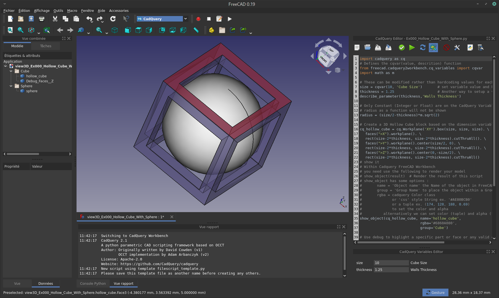
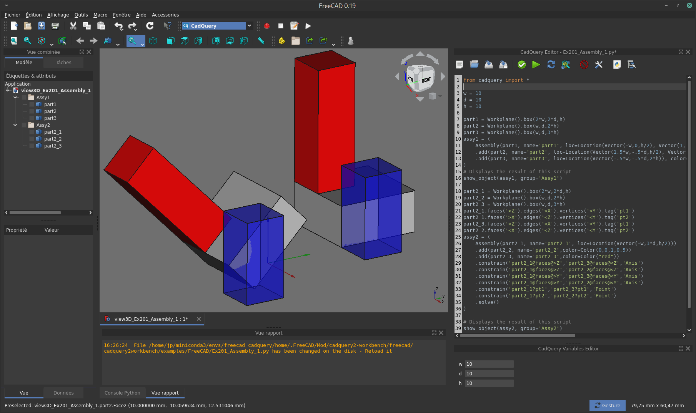
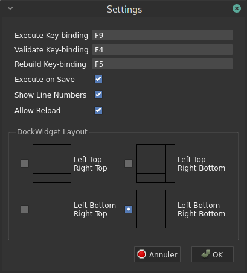
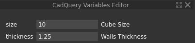

CadQuery 2.x Workbench for FreeCAD
=======================


## Introduction

This is a FreeCAD Workbench to render CadQuery 2.x script in FreeCAD.

<br/>



## Notable features
* Dedicated CadQuery Python scripting editor
  * It uses default FreeCAD python editor settings: Font, Font size, python Color Scheme
* Dedicated Toolbar: File Management, Script exectution, ...
* Cadquery Variables Editor
* For detailed instruction see [Instruction](#usage)

## Installation

As the easiest way to install CadQuery and its dependencies is using conda, it is recomanded to install both FreeCAD and CadQuery into a dedicated conda environment. Then download the [latest released version]() of this workbench, extract the archive file and copy the entire extracted directory to FreeCAD's `Mod` directory on your environment.

#### Install cadQuery 2.x and FreeCAD in a conda environment
For more details regarding conda installation refer to [CadQuery](https://github.com/CadQuery/cadquery) and [FreeCAD](https://wiki.freecadweb.org/Conda)
```
# Set up a new environment
conda create -n freecad_cadquery

# Activate the new environment
conda activate freecad_cadquery

# Install both CadQuery and FreeCAD
conda install -c conda-forge freecad
conda install -c conda-forge -c cadquery cadquery=master
```

#### Seting up your conda environment
To preserve your system settings, it is suggested to create a dedicated `home` folder in your conda environment and to set FreeCAD to use this folder.
For more details, refer to [Conda Managing environments](https://docs.conda.io/projects/conda/en/latest/user-guide/tasks/manage-environments.html) and [FreeCAD Start up and Configuration](https://wiki.freecadweb.org/Start_up_and_Configuration).
```
# Create a home dir inside the conda environment
cd $CONDA_PREFIX
mkdir ./home

# Set environment variables
mkdir -p ./etc/conda/activate.d
mkdir -p ./etc/conda/deactivate.d
touch ./etc/conda/activate.d/env_vars.sh
touch ./etc/conda/deactivate.d/env_vars.sh
```
Edit `./etc/conda/activate.d/env_vars.sh` as follows:
```
#!/bin/sh

export HOME=$CONDA_PREFIX/home
export FREECAD_USER_HOME=$CONDA_PREFIX/home
```
To apply the changes, deactivate from the environment then activate it again.<br/>
Then run FreeCAD, so that it will create in your new environment home folder the `.FreeCAD/Mod` directory.
```
conda deactivate
conda activate freecad_cadquery

cd $Home
freecad
```
Note: having create a dedicated home folder, at first execution FreeCAD set all defaults settings. If you have FreeCAD already installed in your computer, and have already made some user setup, there are 3 configuration files you may find useful to copy from your system installation into your new conda environment.

Under `~/.FreeCAD` files `system.cfg` and `user.cfg`

Under `~/.config/FreeCAD` file `FreeCAD.conf`

#### Install this cadquery2-workbench
* Download the [latest released version]() of this workbench
* Extract the archive file
* Copy the entire extracted directory to FreeCAD's `Mod` directory on your environment.

## Usage

#### Activate CadQuery workbench
In FreeCAD, select CadQuery workbench from the Workbench dropdown list in the Workbench toolbar.
It opens CadQuery Editor and CadQuery variables Editor panes on the right DockWidget of FreeCAD.<br/>
To Show/Hide the Editor, use the standard FreeCAD `View`->`Panels` from the menu.


#### Commands


* File Management
  * `New Scirpt (Alt+Shift+N)` Start a new script from a template file
  * `Open Script (Alt+Shift+O)` Open a pyton script file
  * `Save Script (Alt+Shift+S)` Save current script
  * `Save Script As` Open a Save As dialog box to save current script
* Script Commands
  * `Validate Script (F4)` Execute cadquery script but do not display the objects in FreeCAD. Use it to validate your script.
  * `Execute Script (F9)` Execute cadquery script and display objects in FreeCAD. Variables use values from the Variables Editor. If you add a new variable in the script and run again Execute, the new variable is not added into the Variables Editor.
  * `Rebuild Script (F5)` Rebuild and execute the script. Variables Editor is reset from the values in the script.
  * `Toggle Debug Script` when toggle on, `debug()` objects will be displayed in FreeCAD.
* Others
  * `Clear Output (Alt+Shift+C)` clears all output from the Report View. This comes in handy during a heavy script debugging session.
  * `Settings` open the Settings dialog box, see below for details.
  * `Examples` Holds a list of all the CadQuery examples that are bundled with this workbench. They're a great tool for learning CadQuery. Those scripts come from [CadQuery](https://github.com/CadQuery/cadquery) project.
  * `Expand Tree Groups` when using group in the `show_object()` method, FreeCAD collapse all the groups. This button expand all groups in the Tree View.


#### User Settings
<br/>

* `Key-binding` you can set your own shortcuts to **Execute**, **Validate** or **Rebuild** commands.
* `Execute on Save` Automatically Rebuild a script every time you save it. The default is **False**.
* `Show Line Numbers` show/hide the line numbers in cadquery editor. The default is **True**.
* `Allow Reload` automatically reloads and executes the open script when an external change is made. This allows users to use their preferred code editor instead of the one included with this workbench. The default is **False**. When **False** is set, user will be prompt to reload or not the file when a change on disk is made.
* Note: You may need to restart FreeCAD to have above new settings taken in count.
* `Dock Widget Layout` allow to change the FreeCAD dock widgets layout for more convenience.

#### Python editor
Use the standard [FreeCAD Editor settings](https://wiki.freecadweb.org/Preferences_Editor#Editor) to change the Font, Font size and python color scheme.

#### Showing Objects
You need use the `show_object(cq_obbject [, options])` method to render your model in FreeCAD
* first parameter is a valid CadQuery object
* optional options:
  * name: `String` the name of the part
  * group: `String` in FreeCAD you can organize your parts within Groups, providing a group name
  * rgba (you can use one of those to define it):
    * `CadQuery Color` see [Assembly colors](https://cadquery.readthedocs.io/en/latest/assy.html#assembly-colors) for a list of valid color name
    * `String` `css style` like '#RRGGBB' or '#RRGGBBAA' with RR,GG,BB,AA hexa in range [0-255]
    * `Tuple` (r, g, b, a) with r,g,b in range [0-255] and a in range [0.0-1.0]
    * alternatively, instead of rgba you can provide separately both options
      * color: as a `Tuple` (r, g, b) in range [0-255]
      * alpha: `Float` in range [0.0-1.0]

#### Debugging Objects
It is possible to do visual debugging of objects by using the `debug()` function to display an object instead of `show_object()`.
```python
import cadquery as cq

result = cq.Workplane().box(10, 10, 10)

highlight = result.faces('>Z')

show_object(result, name='box')
debug(highlight)
```
Objects displayed with `debug()` are colored in red and have their alpha set so they are semi-transparent. This can be useful for checking for interference, clearance, or whether the expected face is being selected, as in the code above.
Optional `name` and `group` can be provided.
You have to toggle on the `Toggle Debug Script`  tool button in CadQuery Editor to display `debug()` objects.

#### Script variables
This workbench uses the following rules to find input variables for a script:
  * only top-level `int` and `float` statements are considered
  * only assignments of constant values to a local name are considered.

For example, in the following script:
```python
h = 10
w = 2.0
d = h / 2.0
foo = 'bar'

def some_function():
    x = 1
```
`h` and `w` will be overridable script variables, but `d`, `foo` and `x ` are not.

We can assign a description of the variables in 2 different way:
```python
# Defines the cqvar(value, descrition) function
from freecad.cadquery2workbench.cq_variables import cqvar
size = cqvar(10, 'Cube Size')       # set variable value and his description
thickness = 1.25                    # Another way to setup a variable and his description
describe_parameter(thickness,'Walls Thickness')
```
 Change values then press `Enter` to update your model.

## License

CadQuery 2.x Workbench for FreeCAD is licensed under the terms of the [Apache Public License, version 2.0](http://www.apache.org/licenses/LICENSE-2.0).

## Acknowledgment
This workbench is a fork of the [cadquery-freecad-module](https://github.com/jmwright/cadquery-freecad-module) from **Jeremy Wright**, that was design for CadQuery v1.x

A great thanks to all contributors to the great tool that is CadQuery and in particular to **David Cowden**, **Adam Arbanczyk** and **Jeremy Wright**.
